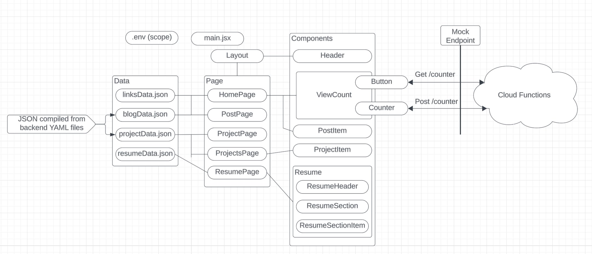
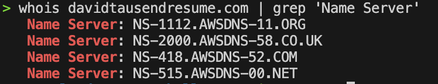
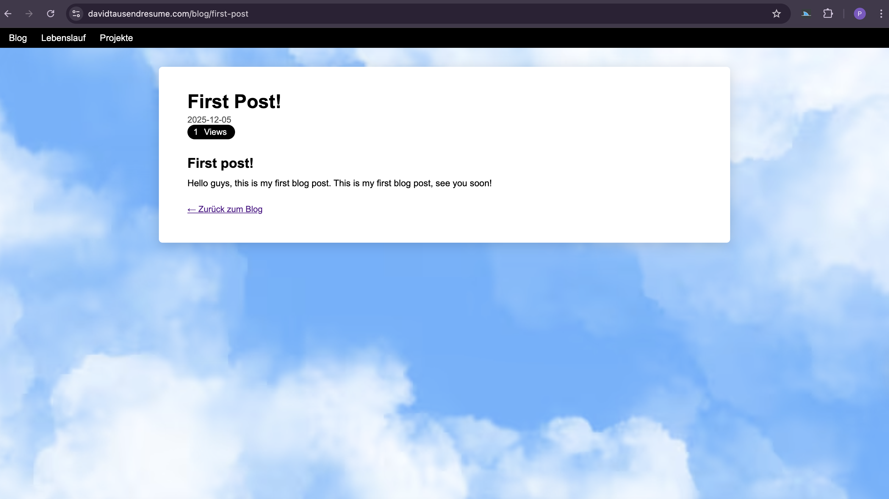
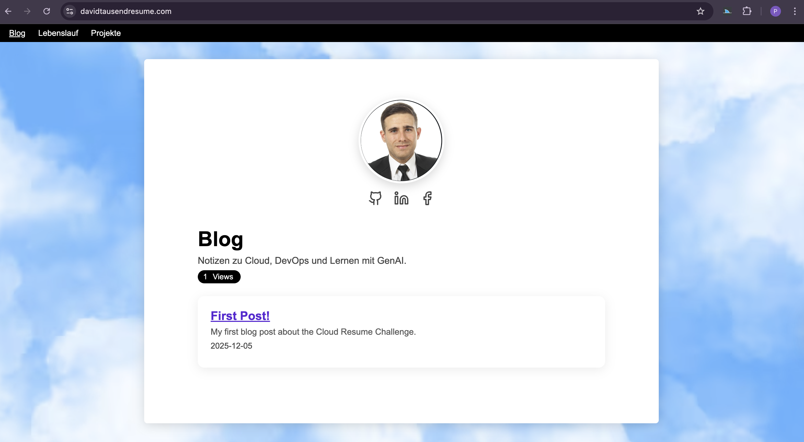
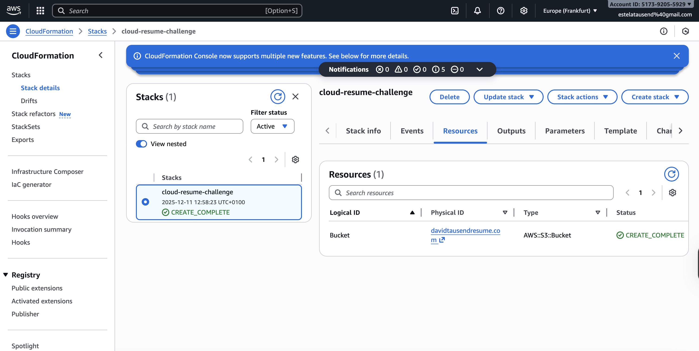
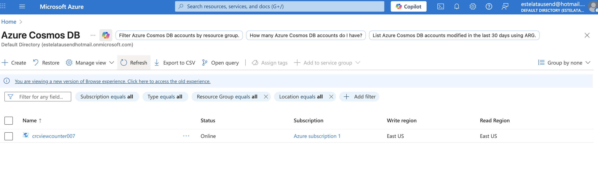
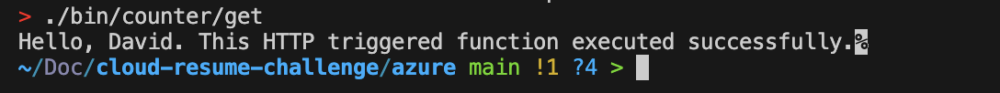
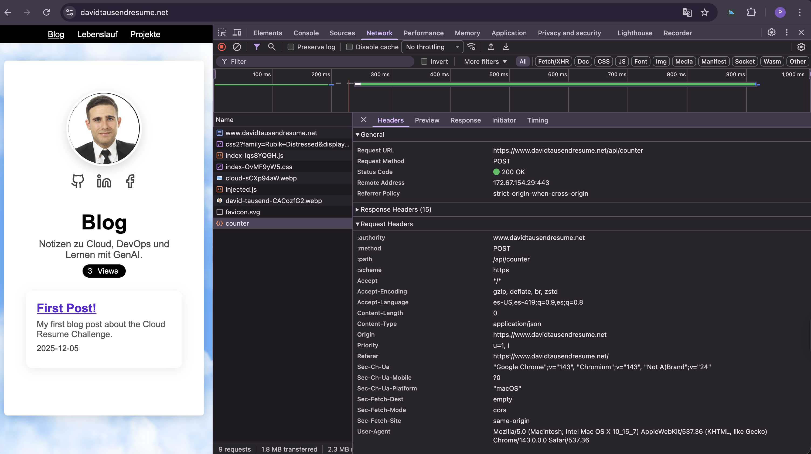
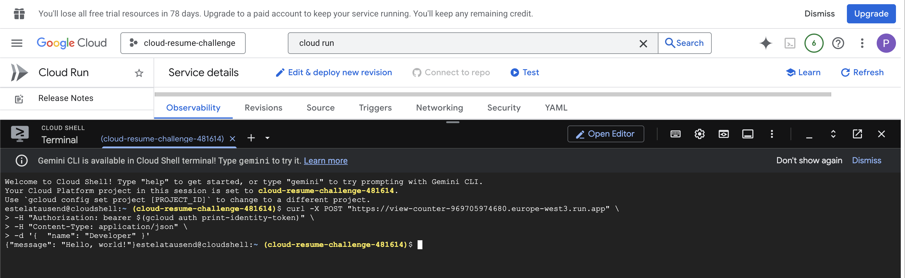
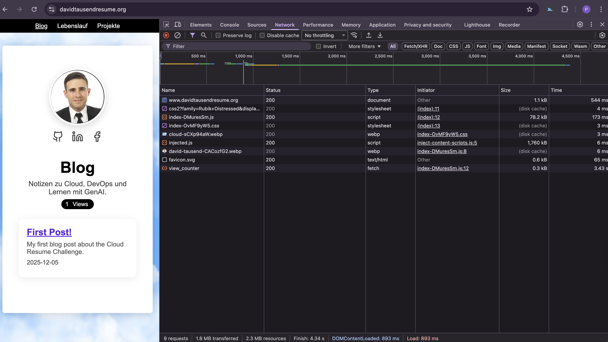

<h1 align="center">cloud-resume-challenge</h1>

## Documents
- [Frontend](./frontend/README.md)
- [AWS](./aws/README.md)
- [Azure](./azure/README.md)
- [GCP](./gcp/README.md)

## Introduction

This repository documents my implementation of the Cloud Resume Challenge across multiple cloud providers.  
The goal of the project is to demonstrate practical cloud engineering skills, including frontend development, serverless backends, Infrastructure as Code, CI/CD concepts, and cloud-native services.

The project is intentionally implemented in AWS, Azure, and Google Cloud Platform to compare architectures, services, and deployment workflows across providers. Each cloud implementation follows the same core idea: a static resume website with a dynamic visitor counter backed by a serverless API and a managed database.

## Table of Contents

- [Documents](#documents)
- [Introduction](#introduction)
- [Programming Languages](#programming-languages)
- [Frontend Diagram](#frontend-diagram)
- [AWS](#aws)
  - [AWS Diagram](#aws-diagram)
  - [AWS Zones](#aws-zones)
  - [AWS Blog Post](#aws-blog-post)
  - [AWS Counter](#aws-counter)
- [Azure](#azure)
  - [Azure Diagram](#azure-diagram)
  - [Azure Bucket](#azure-bucket)
  - [Azure Cosmos DB](#azure-cosmos-db)
  - [Azure Function Deployment](#azure-function-deployment)
  - [Azure Function](#azure-function)
  - [Azure Counter](#azure-counter)
- [GCP](#gcp)
  - [GCP Function](#gcp-function)
  - [GCP Local Counter Test](#gcp-local-counter-test)
  - [GCP Counter](#gcp-counter)
- [Applications, Plugins & Tools Used](#applications-plugins--tools-used)
- [Problems](#problems)
- [Acknowledgments](#acknowledgments)

## Programming Languages

- [HTML](https://de.wikipedia.org/wiki/Hypertext_Markup_Language)
- [CSS](https://de.wikipedia.org/wiki/Cascading_Style_Sheets)
- [JavaScript](https://developer.mozilla.org/en-US/docs/Web/JavaScript)
- [Python](https://www.python.org/)
- [Terraform](https://www.terraform.io/)
- [YAML](https://yaml.org/)

## Frontend Diagram

The frontend is a static site built with modern JavaScript tooling and deployed to object storage on each cloud provider.  
It communicates with a serverless backend API to fetch and increment the page view counter.

## AWS

### AWS Diagram

Note: The diagram is partially simplified because it was created using the Lucidchart free version.

### AWS Zones

This section documents the AWS regions and availability zones used during deployment.

### AWS Blog Post

A blog post is hosted on AWS to demonstrate static content delivery and routing.

### AWS Counter

The AWS visitor counter is implemented using a serverless function and a managed NoSQL database, exposed via an HTTP endpoint.

## Azure

### Azure Diagram

### Azure Bucket

### Azure Cosmos DB

### Azure Function Deployment

### Azure Function

### Azure Counter

The Azure implementation uses Azure Functions, Cosmos DB, and static website hosting.  
Infrastructure is defined declaratively and deployed in a reproducible manner.

## GCP

### GCP Function

### GCP Local Counter Test

### GCP Counter

The GCP version uses Cloud Functions (Gen 2), Firestore, and Google Cloud Storage.  
Terraform Cloud is used for remote state management and deployments.

## Applications, Plugins & Tools Used

- GitHub for version control, documentation, and repository hosting
- Terraform for Infrastructure as Code across all cloud providers
- Ansible for orchestration and deployment automation
- Google Cloud SDK, AWS CLI, and Azure CLI for local cloud interaction
- TinyPNG for image optimization
- ChatGPT for debugging assistance, documentation refinement, and architectural validation

## Problems

During the project, several challenges were encountered, including cross-cloud differences in IAM models, CORS configuration for serverless APIs, Terraform Cloud workspace handling, and frontend-to-backend URL normalization.  
Each issue was resolved through iterative debugging, documentation review, and incremental testing.

## Acknowledgments

I give thanks to Andrew Brown for his guidance and the Cloud Resume Challenge instructions.  
The project was extended to multiple cloud providers to deepen hands-on experience with modern cloud architectures, automation, and DevOps practices.